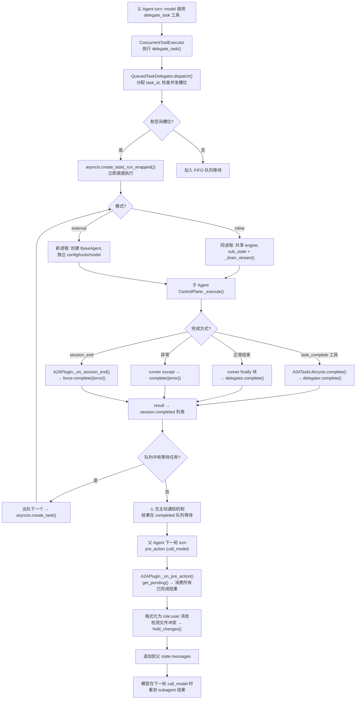
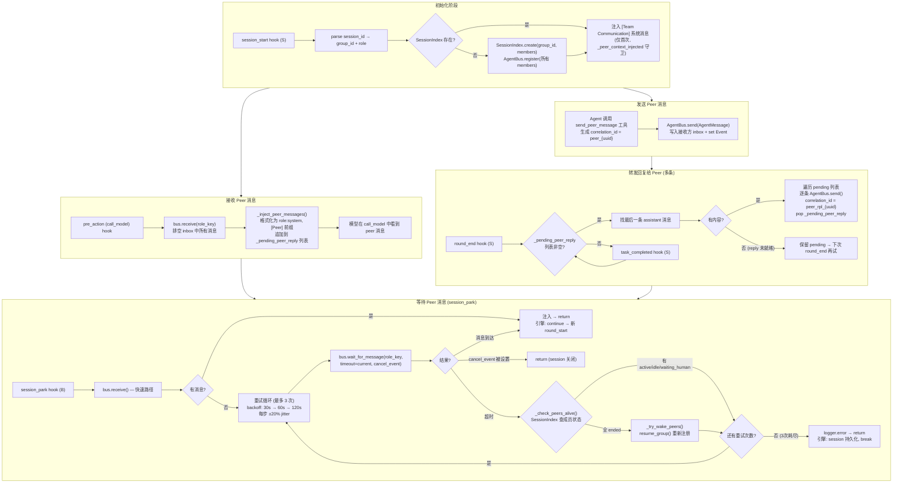
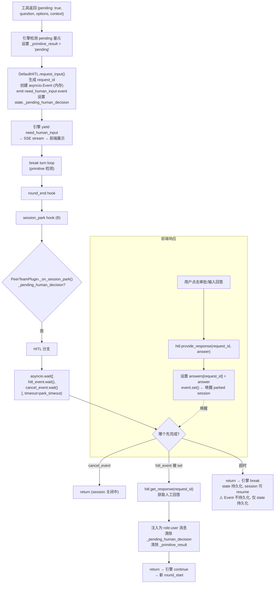

# ARF 会话控制平面 — 流程图与卡点分析

## 1. 主控制循环 (ControlPlane._execute)

```mermaid
flowchart TD
    START["BaseAgent.chat() / astream()"] --> RESOLVE["_resolve_session()<br/>加载/创建 session state"]
    RESOLVE --> APPEND["追加 user message 到 state.messages"]
    APPEND --> EXECUTE["ControlPlane.invoke() / astream()"]
    EXECUTE --> SESSION_START

    SESSION_START{"_session_opened?"} -->|"否 (首次)"| SS_FIRE["🔥 session_start hook (B+S)<br/>PeerTeamPlugin: 创建 SessionIndex<br/>注入 skills/tools/memory 系统消息"]
    SS_FIRE --> UI_EVENT["yield user_input event"]
    SESSION_START -->|"是 (resume)"| UI_EVENT

    UI_EVENT --> ROUND_LOOP{"while not aborted<br/>and not completed"}

    ROUND_LOOP --> CANCEL_CHECK{"_cancelled()?<br/>(close() 设置了 cancel_event)"}
    CANCEL_CHECK -->|"是"| SESSION_END
    CANCEL_CHECK -->|"否"| ROUND_START

    ROUND_START["round += 1<br/>🔥 round_start hook (B+S)<br/>UndoPlugin: begin_round() snapshot"] --> TURN_LOOP{"while True"}

    TURN_LOOP --> GATE1{"gate.is_exceeded()?<br/>max_turns / max_tokens"}
    GATE1 -->|"是"| GATE_EXCEEDED["yield gate_exceeded → break turn loop"]
    GATE1 -->|"否"| TURN_START["turn += 1<br/>🔥 turn_start hook (B+S)"]

    TURN_START --> PRE_MODEL["🔥 pre_action hook (B, step=call_model)<br/>A2APlugin: 注入 subagent 完成结果<br/>PeerTeamPlugin: 注入 peer 消息"]

    PRE_MODEL --> MODEL_CALL["_action_call_model()<br/>ModelDegrader → ModelAdapter → LLM<br/>流式: yield thinking/text/tool_call_chunk<br/>追加 assistant msg + tool_calls"]

    MODEL_CALL --> HAS_TOOLS{"has_tool_calls?"}

    HAS_TOOLS -->|"是"| PRE_TOOL["🔥 pre_action hook (B, step=execute_tools)<br/>ToolGuardPlugin: 权限检查<br/>ApprovalPlugin: 审批阻塞"]
    PRE_TOOL --> EXEC_TOOLS["_action_execute_tools()<br/>ConcurrentToolExecutor<br/>🔥 tool_output hook (B)<br/>CompactionPlugin: externalization"]

    EXEC_TOOLS --> POST_ACTION["🔥 post_action hook (B+S)<br/>TracePlugin: 写入 JSONL"]

    HAS_TOOLS -->|"否"| POST_ACTION

    POST_ACTION --> TURN_END["🔥 turn_end hook (B+S)<br/>persist state → state_store.put()"]

    TURN_END --> CHECK_EXIT{"has_tool_calls?"}
    CHECK_EXIT -->|"否 (纯文本响应)"| TURN_EXIT["break turn loop"]
    CHECK_EXIT -->|"是"| CHECK_PRIM{"_primitive_result?<br/>(pending / task_completed)"}
    CHECK_PRIM -->|"是"| PRIM_EXIT["break turn loop"]
    CHECK_PRIM -->|"否"| GATE2{"gate check"}
    GATE2 -->|"超过"| GATE_EXCEEDED
    GATE2 -->|"否"| TURN_LOOP

    TURN_EXIT --> ROUND_END
    PRIM_EXIT --> ROUND_END
    GATE_EXCEEDED --> ROUND_END

    ROUND_END["🔥 round_end hook (B+S)<br/>CompactionPlugin: 压缩检查<br/>PeerTeamPlugin: 转发回复给 peer<br/>A2APlugin: 更新 child_tasks 状态"] --> TASK_DONE{"primitive == task_completed?"}

    TASK_DONE -->|"是"| TASK_HOOK["🔥 task_completed hook (S)<br/>PeerTeamPlugin: 转发最终回复"]
    TASK_DONE -->|"否"| GATE3{"gate check"}

    TASK_HOOK --> GATE3
    GATE3 -->|"超过"| GATE_EXCEEDED2["yield gate_exceeded → break round loop"]
    GATE3 -->|"否"| PARK_CHECK{"last msg role<br/>不是 user/system?"}

    PARK_CHECK -->|"是"| SESSION_PARK["🅿️ session_park hook (B)<br/>详见 §4"]
    PARK_CHECK -->|"否 (已有新输入)"| ROUND_LOOP

    SESSION_PARK --> PARK_RESULT{"有新消息注入?"}
    PARK_RESULT -->|"是"| ROUND_CONTINUE["yield round_continued → continue"]
    ROUND_CONTINUE --> ROUND_LOOP
    PARK_RESULT -->|"否"| EXIT_ROUND["yield round_exit → break round loop"]
    GATE_EXCEEDED2 --> EXIT_ROUND

    EXIT_ROUND --> PERSIST["state_store.put()"]
    PERSIST --> SESSION_END["close() → 🔥 session_end hook (B+S)"]
    SESSION_END --> DONE["返回最终 AgentState"]
```



## 2. A2A Subagent 流程



## 3. A2A Peer 通信流程



## 4. HITL 人机交互流程



## 5. Session Park 等待事件全景

当前 `PeerTeamPlugin._on_session_park()` 内部结构：

```
_on_session_park():
    if _pending_human_decision:     # 分支 A: HITL
        wait(hitl_event, cancel_event)
        return (注入 user msg 或 超时)

    # 分支 B: Peer — 仅当 HITL 分支未触发时才执行
    fast_path: bus.receive()
    if has_message: return

    retry_loop: wait_for_message() × 3
```

**问题 1: 缺少 Subagent 结果等待**。`A2APlugin` 没有注册 `session_park` hook，子 agent 完成时 `QueuedTaskDelegator.complete()` 不发送任何通知给父 session 的 park。

**问题 2: HITL 和 Peer 等待是串行的** (见代码 `control_plane.py:159` 和 `plugin.py:157-202`)。如果 `_pending_human_decision` 存在，直接进入 HITL 分支并 return，peer 等待完全被跳过。反过来，如果没有 HITL pending，才进入 peer 等待。

### 期望的三路并行等待

```
session_park 应该同时等待三件事:
  ┌─ HITL event (DefaultHITL._events[request_id])
  ├─ Subagent 结果 (新: delegator 完成通知 event)
  └─ Peer 消息 (AgentBus.wait_for_message)
  
  任一事件触发 → 唤醒 → 注入对应消息 → continue 新 round
  cancel_event → 最高优先 → 所有等待终止
```

### 哪些需要写入 state 以便 resume?

| 等待对象 | 当前持久化? | 问题 |
|---------|-----------|------|
| `_pending_human_decision` (含 request_id) | ✅ state 中 | Event 对象不持久化, resume 需重建 |
| Peer 消息等待状态 | ❌ | 无状态标记, resume 时重新开始 3 次重试 |
| Subagent 完成通知 | ❌ | delegator 状态在内存, `child_tasks` 虽有 status 但 resume 时不检查 |

**resume 时需要重建的内容:**
- HITL: 从 `_pending_human_decision.request_id` 重建 Event (`hitl.get_response_event()` 或 `hitl._events[request_id] = asyncio.Event()`)
- Subagent: 检查 `child_tasks` 中 status="running" 的项 → 创建对应的完成通知 Event
- Peer: 重新注册 AgentBus + 从 SessionIndex 恢复成员状态

## 6. 卡点与断点分析

### 🔴 P0: Subagent 完成无主动通知 (断点)

```
timeline:
  父 session: turn N → round_end → session_park → 等待(peer/HITL) → 超时 → session_end
  子 agent:                                    ↑ 正在运行...
  子 agent:                                 ... → 完成 → delegator.complete()
  父 session:                                    ↑ 结果在队列, 无人唤醒

  下次 chat(): pre_action(call_model) → get_pending() → 才发现结果
```

**根因**: `QueuedTaskDelegator.complete()` 没有通知机制。`A2APlugin` 没有注册 `session_park`。

**修复方向**: 
1. A2APlugin 注册 `session_park` hook
2. 在 `_registry` 中维护 `{parent_sid: asyncio.Event}` 映射
3. `delegator.complete()` 时 set Event, `A2APlugin._on_session_park()` wait 该 Event
4. Event 信息写入 state (`_park_subagent_events`) 以便 resume 重建

### 🔴 P0: HITL Event 内存态与持久态分离 (断点)

```
request_input():
  state["_pending_human_decision"] = {...}  # ✅ 持久化到 FileStateStore
  self._events[request_id] = asyncio.Event() # ❌ 仅内存

resume 时:
  state._pending_human_decision 存在 ✓
  hitl.get_response_event(request_id) → ?
    - 如果进程未重启 → Event 还在 → 正常
    - 如果进程重启 → Event 丢失 → get_response_event() 返回 None
    - 如果 cancel_request() 被调用 → Event 被 pop → 返回 None

_on_session_park():
  event = hitl.get_response_event(...)
  if event is None: return  # 静默跳过! session 直接结束
```

**修复方向**: resume 时检查 `_pending_human_decision` 存在但 Event 缺失 → 重建 Event 并注册到 DefaultHITL

### 🟡 P1: session_park 内 HITL 和 Peer 等待串行

当前代码 (`plugin.py:157-200`):

```python
# 分支 A: HITL — 如果命中, 直接 return, peer 等待被跳过
decision = state.get("_pending_human_decision")
if decision:
    ... wait HITL ...
    return  # ← 这里 return 后, peer 等待不会执行

# 分支 B: Peer — 仅在 HITL 分支未触发时才执行
bus = _registry.agent_bus
...
```

**影响**: 如果 agent 同时有 HITL pending 和 peer 消息, peer 消息会被阻塞直到 HITL 解决。应该三路并行。

**修复方向**: 拆分为独立等待任务, `asyncio.wait([hitl_task, subagent_task, peer_task], return_when=FIRST_COMPLETED)`

### 🟡 P2: close() 与 session_park 竞态

```
close() 设置 cancel_event → session_park 在 wait_for_message() 中检查 ✓
但 alive check / wake 操作期间不检查 cancel_event:
  _check_peers_alive() → 文件 I/O
  _try_wake_peers() → SessionIndex + AgentBus 操作
```

用户确认: **close() 指令最优，takeover all**。当前 cancel_event 已传入 `wait_for_message()` 和 HITL 的 `asyncio.wait()`，中间操作短暂，风险低。

### 🟢 P3: _pending_peer_reply — 已修复为列表

当前代码 (`plugin.py:315-316`) 已经是列表合并:
```python
existing = state.get("_pending_peer_reply", [])
state["_pending_peer_reply"] = existing + pending
```

`_forward_peer_reply()` 遍历列表逐条转发。`send_peer_message` 工具生成 `correlation_id = peer_{uuid}`。**无断点**。

### 🟢 P4: QueuedTaskDelegator fire-and-forget

`_run_wrapped()` 通过 `asyncio.create_task()` 调度。进程崩溃后:
- 子 agent 状态可能部分写入 FileStateStore
- `child_tasks` 状态仍为 "running" 或 "pending"
- resume 时可通过 `child_tasks` 状态判断: pending/running → 未完成, completed/error → 已完成

用户确认: **下次检查队列状态更新即可**。resume 时扫描 `child_tasks` + delegator 队列状态做 reconciliation。

### ✅ P5: session_park 异常 → abort — 设计如此

场景: `session_park` 中 PeerTeamPlugin 抛出异常 (如 SessionIndex 文件损坏、AgentBus 状态异常):

```
_on_session_park() 抛异常
  → 引擎 _fire_blocking("session_park") 捕获
  → _dispatch_error(exc, state, ctx)
  → ErrorHandlerPlugin._on_error() 分类:
      - 上下文溢出? 否
      - 瞬态传输? 否
      - 消息合同? 否
      - 守卫/审批拒绝? 否
      - 工具执行失败? 否
      → 未知错误 → 不设置 _recovery_decision
  → 引擎: _recovery_decision 未设置 → raise SessionAbortedError
  → session 被 abort
```

**这是正确行为**。session_park 阶段的异常意味着基础设施状态已不可信（SessionIndex 损坏、AgentBus 异常等），跳过 park 继续下一轮只会带着损坏的状态"无脑狂奔"。直接 abort 让调用方感知到故障，比静默掩盖更有价值。

---

## 7. 改进汇总

| 优先级 | 问题 | 方向 |
|--------|------|------|
| **P0** | Subagent 结果无通知，父 session park 等不到 | A2APlugin 注册 session_park + delegator 完成时 set Event + 写入 state |
| **P0** | HITL Event 不持久化，resume 时静默丢失 | resume 时从 `_pending_human_decision` 重建 Event |
| **P1** | HITL / Subagent / Peer 三路等待串行 | 拆分为三路 `asyncio.wait(FIRST_COMPLETED)` |
| **P2** | close() 中间操作不检查 cancel | 可接受，中间操作短暂 |
| **✅** | `_pending_peer_reply` 覆盖 | 已修复为列表 |
| **✅** | send_peer_message 无 correlation_id | 已有 `peer_{uuid}` |
| **✅** | session_park 异常 → abort | 设计如此，基础设施不可信时提前退出 |
